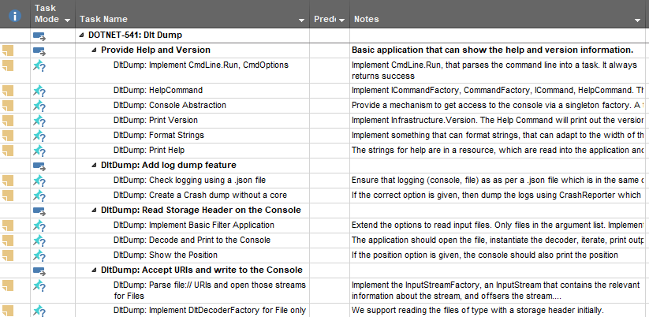

# Planning Breakdown for Agile from Architecture for Embedded <!-- omit in toc -->

(C) Jason Curl, 2022.

Over the last seven years working in Automotive, I've been exploring methodical
ways to plan construction of software so that:

* It can be incrementally built with new value shown at incremental steps during
  the project
* The break down of tasks in small pieces that they can be assigned to various
  team members of similar skill sets
* Communication of design and implementation to various team members

- [1. Motivation](#1-motivation)
  - [1.1. What do Customers Want](#11-what-do-customers-want)
  - [1.2. Get to Know your Users](#12-get-to-know-your-users)
  - [1.3. Break Down Boundaries Between Teams](#13-break-down-boundaries-between-teams)
- [2. Background and Assumptions](#2-background-and-assumptions)
  - [2.1. Mock Ups and Prototypes](#21-mock-ups-and-prototypes)
  - [2.2. System Architecture](#22-system-architecture)
  - [2.3. Software Architecture](#23-software-architecture)
- [3. Component Architecture and Planning](#3-component-architecture-and-planning)
  - [3.1. A Background on Agile Planning Structure](#31-a-background-on-agile-planning-structure)
  - [3.2. Defining the User Stories (Use Cases)](#32-defining-the-user-stories-use-cases)
  - [3.3. Start Building the Architecture](#33-start-building-the-architecture)
  - [3.4. Construct the Tasks](#34-construct-the-tasks)
- [4. An Example of Construction](#4-an-example-of-construction)
  - [4.1. Requirements Construction](#41-requirements-construction)
  - [4.2. Design](#42-design)
  - [4.3. Organizing Construction](#43-organizing-construction)
    - [4.3.1. Mind Mapping for Tasks](#431-mind-mapping-for-tasks)
    - [4.3.2. Task Based List](#432-task-based-list)
  - [4.4. Jira](#44-jira)

## 1. Motivation

### 1.1. What do Customers Want

Agile acknowledges that customers cannot specify all details up front, obstacles
will appear on the way, and what seemed important at the beginning turns out not
to be important at all (and the reverse is true, new information arrives during
the project increasing priority of tasks).

A customer wants to know

* What's needed, or how long it takes for the first feature to arrive
* How to get there
* How quickly teams can adapt to changes in the requirements

This document tries to provide a pragmatic approach that could be adapted to
suit your own projects, concentrating on a specific team implementing a specific
component within a much larger project and system architecture.

### 1.2. Get to Know your Users

Knowing your users is not the same as knowing your customer. Every developer
should strive to know why we're building this component. Who are the stake
holders? How do they plan to use the component?

Various stake holders may be the person or organization:

* commissioning the software project;
* that will test the software;
* The end users that want to achieve their goals;
* power users or beginners, and their skill levels;
* those that will train others in the usage of the software;
* the support team handling incoming complaints for the software;
* etc.

Depending on the use cases, the stake holders may be different.

### 1.3. Break Down Boundaries Between Teams

The motivation of this document is to remind every agile team that success comes
from breaking down boundaries. Asking questions and having every one work
towards a common goal is the most likely way to build success.

This starts from the customer and stake holder discussions at every level. Be
curious about more than just the domain problem assigned. Recognize that teams
are not silos and that boundaries between teams must be crossed else use cases
often fail at these boundaries.

Program management should encourage communication between multiple levels. Where
communication must be controlled, it should be encouraged, summarized and then
communicated further.

## 2. Background and Assumptions

Agile doesn't excuse for team structure and experts. Larger projects using Agile
still need people of roles with the experience required to make the correct
decisions, and a structured break down of the larger goals into smaller
achievable goals.

### 2.1. Mock Ups and Prototypes

For a new product, or an existing product with new features, it might not be
immediately obvious on how to implement a feature aimed for those using the
product.

I've found it is absolutely necessary to estimate the high level system design
before one can start with the detailed architecture. It is important to first
verify that most of the work in the next steps make sense. To do this requires:

* Discussions with the stake holders on the use cases from their perspective
* Understand the proposed system designs

and for new products, there are some more fundamental questions that arise:

* Choose the frameworks and prototype (for new products)
* Research best practices and common pitfalls

### 2.2. System Architecture

The System Architecture is the break down of the general requirements so that
they can be allocated between the hardware requirements and the general software
requirements. It is the interface between the hardware and the software.

A product requires breaking down the high level details to the smallest
components. Important questions for embedded devices from customer requirements
that help define the requirements on the system may be:

* Storage Requirements
* Interfaces to external devices
* Bandwidth requirements for I/O (memory, GPU, network, etc.)
* Performance requirements
* Safety requirements
* etc.

In embedded development, hardware generally has strictly time-bound cycles, so
it's important to define the hardware constraints as early as possible.
Identifying requirements on hardware from detailed software requirements later
is expensive to correct, either as workarounds in software, or changes in
hardware. Experience in this phase of the project can help define if the project
meets its time deadlines.

For a software engineer, the outcome is effectively the hardware on which the
software is running and the constraints.

### 2.3. Software Architecture

Depending on the size of the project, a number of dedicated software architects
will then work on defining the common use cases in software, which helps define
the frameworks that all software components should work on. Here it's important
to define:

* Policies for Open Source and Proprietary Code, Licensing constraints
* Choose the Operating System based on the system requirements
* Choose which frameworks should be used, which are common to multiple domains.
  Evaluate the various constraints the organization has (licensing,
  extensibility, in-house development, what common problems are being solved)
* Cover the security requirements and constraints, define the frameworks which
  should be used

The second task of a software architecture is to document the decisions made and
allocate the requirements from the system architect to individual components.
There may be elements of reuse required influencing the structure and size of
new components. Although undesirable, an organizational structure may influence
the architecture design.

The output for a software engineer is to receive more detailed requirements and
design details for their components and to have more information about the
realization of customer use cases through sequences and data flow analysis, or
other modelling and simulation.

## 3. Component Architecture and Planning

This section goes into the most detail for software engineers to take a software
and a system architecture and generate a plan on how to construct software
components. They are encouraged to discuss further with the stake holders to
learn as much as possible about the common use cases and constraints while
constructing the software. Stake holders may be the customers, program managers,
software architects that defined the constraints on the components and system
architects.

Even here, the success in building a product is building something that others
want to use.

Questions that sound irrelevant may become important later, such as power
requirements, how the system works. It helps them make the right decisions and
to learn relationships with otherwise abstract requirements.

### 3.1. A Background on Agile Planning Structure

The following sections will use the terms:

* An initiative. This is a high level feature, usually at the customer level,
  which may require deliveries from multiple teams. It would describe the
  customer user story, that might be:

  "As the driver, I want to be able to give a command via speech and it
  navigates me there"

  This may need multiple devices (the navigation radio, an internet gateway, a
  speech server either local or remote, etc.), multiple suppliers.

  The responsibility of the Initiative is a level higher than the software
  development team, with a separate test team and customer acceptance.

* An Epic. Generally I prefer to have only one Epic per team, that keeps the
  responsibility of the Epic within the team, empowering them to do what ever is
  required to meet the goals and promoting ownership for the Epic by the team.
  It empowers clearer boundaries between teams, enabling better autonomy. The
  assignee for the Epic is responsible for driving its completion.

* User Stories. An Epic is broken down into user stories, which is the smallest
  customer visible use case for the Epic / component being developed. It should
  be written using Agile methodologies, such as

  "As persona, I want to ..., so that ..."

  This makes a user story testable, and when completed, can be easily
  demonstrated to the customer.

* Tasks. These are those which are then linked to the user stories, breaking
  them down into smaller portions, which when all put together, build the user
  story. This is the smallest unit of planning.

* Software Pull Request. From a software perspective, this is the implementation
  of something. It doesn't have to be code, it could be documentation describing
  how code should work. One or more software pull requests would satisfy a task
  or a story. In some cases, one pull request may satisfy multiple tasks (but
  not generally so).

### 3.2. Defining the User Stories (Use Cases)

As a team (someone that understands the customer, the system and the software
architecture, the team lead, the component software architect and the
developers) should work together to identify the use cases that are required.

The customer use cases are then broken down into smallest visible component use
cases that can be demonstrated at the end of a sprint, usually as part of a
sprint review.

Try and define as many use cases as is possible. Having multiple use cases
supports validating the architecture in the next steps. While Agile is about
being flexible, it shouldn't be construed as to not doing proper design work,
and with each change in use case or requirements results in continuous reworking
of the architecture and design to build what the customer wants.

Agile stories are often written with the idea

"As the *persona*, I want to *action*, so that *result* ...."

The use cases should be prioritized in what is needed first. Collect enough use
cases that planning can be managed. Too many use cases and the planning overhead
is too high by reorganizing and re-estimating.

### 3.3. Start Building the Architecture

Except for small projects, it is difficult for every person in a project to have
detailed knowledge of all parts of the high level design. Motivation for
architecture is the engineering divide and conquer approach, making problems
smaller, which are easier to solve through methods of abstraction.

From the System architecture, to the Software architecture, to the Component architecture
(or high level design) to the detailed design, each step is necessary to simplify the
work to being done.

Good architecture and design are ones that minimally fulfil the use cases, but
are also easily extendable. This document doesn't try to cover how to build an
architecture, but assumes that UML 2.0 could be used to describe the proposed
architecture. This documentation is used to communicate how to build the final
components (this isn't the only way, other mechanisms such as textual design
requirements or a combination of both could be used also).

Upon completion of the architecture and design for the component to be built, it
is simpler to refer to the dependencies within the construction plan to check
that everything is still on track, and then to replay the high level customer
use cases that the solution provided really does meet the customer goals.

Techniques for building an architecture could be:

* Domain Driven Design
* Model-View-Controller or Model-View-Presenter
* Test Driven Design
* Combination of above; and
* other best practices

In any case, it is specific to your domain, and requires expertise to build. The
better the architecture and design, the easier it is then to plan its
construction and make modifications later.

For software systems, it's important to consider:

* Run-time Constraints
* Dependencies to other components, and any constraints that they might apply
* Abstracting those dependencies through modern techniques
* Prototyping upfront with the other components if available, if assumptions are
  correct.

When using UML, this could be:

* Component Diagrams
* Class and Object Diagrams
* Sequence Diagrams on Lifelines
* Activity and Use Case Diagrams
* etc.

While generating and modifying the architecture and design, continuously check
the current use cases to ensure that what is about to be constructed will fulfil
the needs of the project. You may need to get reviews by experts to verify this.
Doing the verification at the architecture and design level can save significant
time during construction, by identifying constraints as early as possible.

The tooling used to model the architecture should be that which best suits the
organization. In my repositories, I prefer a combination of markdown and UML
([Umlet](https://www.umlet.com/), [PlantUML](https://plantuml.com/), [Enterprise
Architect](https://sparxsystems.com/) and others). More advanced tools also
allow simulations to verify designs before implementation, or the conversion of
architecture into automatically generated code.

One should be careful not to write code at the design level. Avoid detailed
design including private members of classes. This is too detailed and may lead
to a lot of unnecessary rework. The focus at this stage is to ensure that use
cases can be realized, and software be flexible to modify in case of feature
removal, changes or addition. Therefore a balance must be found between the time
it takes to rework the design and software, and the time it takes to verify
design before coding starts.

### 3.4. Construct the Tasks

Once sufficient design is established that is considered stable and resilient to
changes, the construction for the areas of interest can start.

A planning task is intended for the following audience:

* The developer that will construct the task
* The reviewers that will review the work once that task is constructed to
  ensure it fulfils the architecture
* The manager that will later see progress in the construction, which can report
  to the customer

The design [doesn't need to be 100%
complete](https://en.wikipedia.org/wiki/Software_architecture#Software_architecture_and_agile_development),
and often it is never complete. It needs to only be sufficiently complete so as
to be confident that when construction starts, it is unlikely that the work will
be discarded so as to maximize user story velocity and minimize the amount of
effort required to deliver those user stories.

Start with a specific user story, the simplest that the design allows to build.

Walk through the design and define the tasks and the order that is required to
build each element within the design to make that user story visible. When
defining a task, consider also software engineering best practices. Consider
software engineering best practices such as mocks, methods for dependency
breaking to support unit testing.

A task should be limited to 1-3 days for implementation by a single (average)
developer on the team. This also supports other best practices, such as pull
requests for reviews are limited in size to keep focuse and reduce rework during
construction.

In each task, document where it fits in the design. Make a copy in the task
which part of the design is being implemented, or which class or method is being
implemented.

If it's not entirely clear upfront, that's fine, but it should be made clear
before the work on that task is started (i.e. in Agile, before it is pulled from
the backlog and put into an active sprint).

## 4. An Example of Construction

The example here is from my work on a side project I was working on in C# where
I explored these best practices.

The design tool used was [Enterprise Architect](https://sparxsystems.com/).

* The customer use case was defined together with the team. It might have been
  "Be able to decode non-verbose DLTs using Fibex files". This was considered as
  an Epic.
* Software requirements were written within EA. I used software requirements as
  they explain *what* rather than how, and helps to identify upfront what the
  constraints are, and identify knowledge that we are missing.
* When we were satisfied that the requirements were clear, we continued with
  modifying the existing architecture and extending it. The use cases identified
  at the very beginning (also documented in EA) along with the constraints
  identified when writing the requirements were used continuously to validate
  the architecture in each review. This consisted of class diagrams, and where
  classes were too abstract, then sequence and activity diagrams.
* The Mind-Map mode of EA was used to generate a planning *network diagram*. It
  was considerably faster providing this diagram in a tool, and then review the
  construction with the team lead before putting this directly into the Agile
  planning tool Jira. One could also use Microsoft Project, or even a
  spreadsheet to note down the contents.
* Once the sequence of steps were shown and seen that something wasn't missing
  (and to identify if something was missing, we used testability and a
  Definition of Done to confirm what the outcome is and the dependencies for the
  task are satisfied in an earlier task), we then manually entered the items
  into Atlassian Jira and then provided the link *blocked by*.

Construction of the software was straight forward, with features working the
first time. The amount of rework was minimal (in some cases the design needed to
be refined, or tasks needed to be split because of new experiences and wrong
assumptions, but these were relatively minor and can be considered daily work).

### 4.1. Requirements Construction

Enterprise Architect was used to identify the requirements. There wasn't much
public information about Fibex files referenced by [Specification of Diagnostic
Log and Trace
4.2.2](https://www.autosar.org/fileadmin/user_upload/standards/classic/4-2/AUTOSAR_SWS_DiagnosticLogAndTrace.pdf)
used at the time, so we wrote down what we learned when trying to compare it
against an Open Source implementation.

 

Later, these requirements could be added with a link to specific elements of the
component to show traceability, i.e. how this design requirement is mapped to
architecture and design. This supports a change to quickly identify where in the
architecture what is impacted.

### 4.2. Design

Once we knew what to build, the next step was to work on a sufficient amount of
design to start construction.

 

It could be a combination of UML and textual documentation, which ever is most
efficient for communication ideas. This was done entirely within EA, using
traceability.

Another suitable alternative, which I've used in other projects, is to maintain
UML using Open Source tools such as [PlantUML](https://plantuml.com/) and
mark-down files which are popular with online GIT repository software, such as
GitHub and BitBucket. An example of such a Design is my
[DltDump](https://github.com/jcurl/RJCP.DLL.Log/blob/fe833e378ea1d23a370657d279f98af87830bcde/apps/DltDump/docs/design.md)
project.

### 4.3. Organizing Construction

I've used two ways to organize the construction:

* A mind map can be used to visualize the ordering of tasks as a network diagram
* Task Based List as in Microsoft Project

#### 4.3.1. Mind Mapping for Tasks

To consider how to organize the construction of the software, Enterprise
Architect was used to build a mind-map. Trying to put these directly in an Agile
tool, such as Jira, was avoided due to:

* Creating tasks in Jira are tedious, not all information is needed as of yet.
  Reworking tasks in Jira in case of a mistake is even more tedious.
* Getting an Overview of dependencies in a single diagram is hard, unless one
  has specialized plugins which we didn't have.
* Using EA is easy to map the elements to the architecture, or sequence
  diagrams, so that information didn't need to be duplicated. Just follow the
  links within EA.
* Reviews were faster, as everything is consolidated on a single page

As an example:

 

You can see where we also use the feature of swim lanes to organize the levels
in the architecture which tickets apply.

When it was understood the design was stable, the construction was relatively
well known, the mind-map elements were then transferred in Jira, which is a much
better planning tool than Enterprise Architect.

 

#### 4.3.2. Task Based List

An alternative to using Mind-Map software is to use a spread sheet or planning
software to note down the tasks for each use case. This method makes it much
easier to reorganize tasks against customer use cases should ordering change
during the planning phase.

Scan through the requirements and architecture building up from the minimum
viable use case and define this as the first story. Then find the smallest
visible feature to add on top. Continue this until a useful version is obtained.
A useful version might not be the complete product, but something that is
worthwhile to demonstrate.

For example, while building a different tool to read DLT files, I used Microsoft
Project to create stories. Then for each story I defined tasks that when
combined, construct that story. The tasks are required to reduce the scope
according to the architecture. Reducing the scope to a task helps keep the
construction manageable by keeping the size of the change small enough for other
members of the team to understand the change being made.

 

### 4.4. Jira

The tasks were copied into Jira. Larger organizations might automate this
process.

Within Jira, one can use plugins, such as the Portfolio plugin by Atlassian, or
the Structure View to better organize the planning. One doesn't necessarily have
to use Jira at all, but it supports Agile workflow very well (by maintaining a
backlog and running sprints).

* Epic
  * User Story 1
    * Task 1.1
    * Task 1.2
    * Task 1.3
  * User Story 2
    * Task 2.1
    * Task 2.2

For example, how I am constructing some of my Open Source software using Jira:

 
