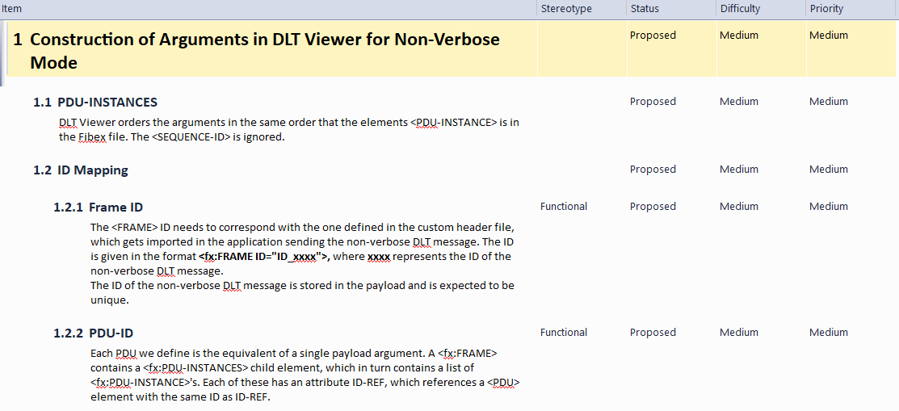
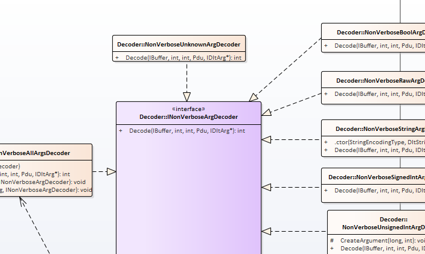
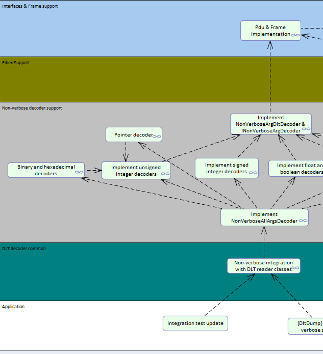
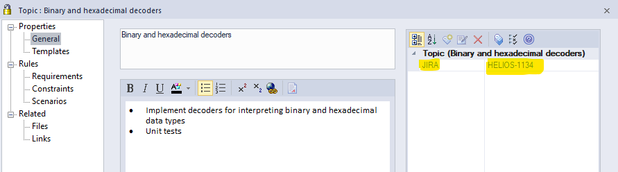
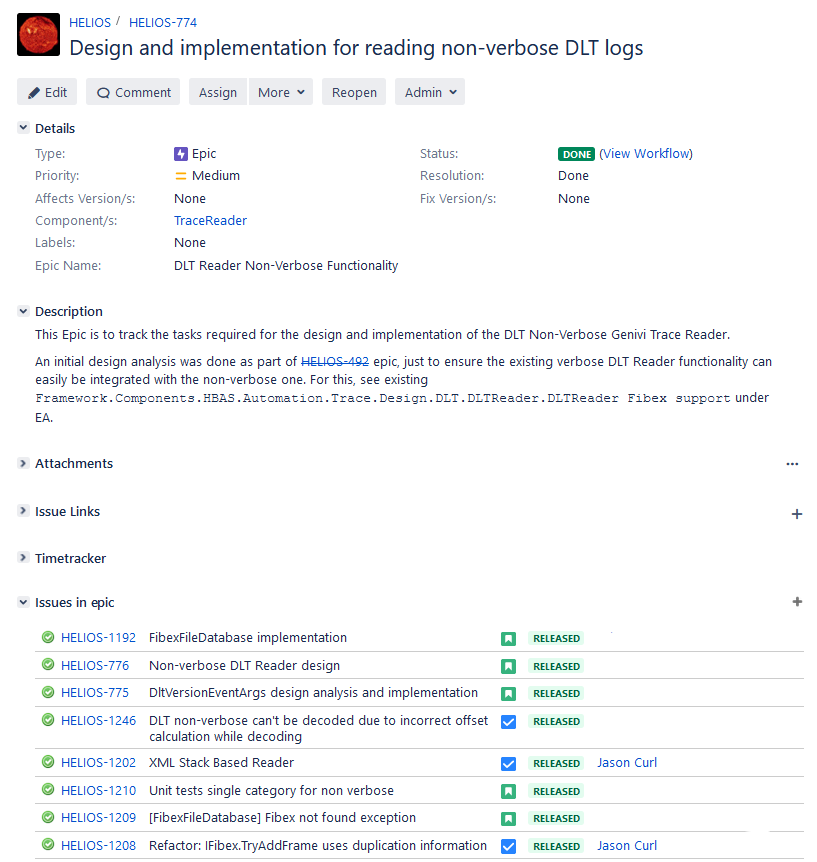
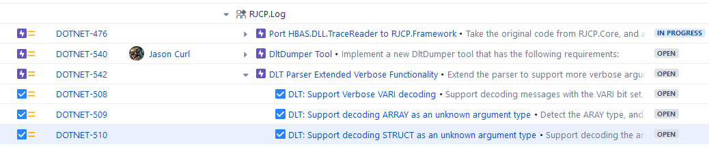

# Planning Breakdown for Agile from Architecture for Embedded <!-- omit in toc -->

(C) Jason Curl, 2022.

Over the last seven years working in Automotive, I've been exploring methodical
ways to plan construction of software so that:

* It can be incrementally built with new value shown at incremental steps during
  the project
* The break down of tasks in small pieces that they can be assigned to various
  team members of similar skill sets
* Communication of design and implementation to various team members

- [1. What do Customers Want](#1-what-do-customers-want)
- [2. Background and Assumptions](#2-background-and-assumptions)
  - [2.1. Mock Ups and Prototypes](#21-mock-ups-and-prototypes)
  - [2.2. System Architecture](#22-system-architecture)
  - [2.3. Software Architecture](#23-software-architecture)
- [3. Component Architecture and Planning](#3-component-architecture-and-planning)
  - [3.1. A Background on Agile Planning Structure](#31-a-background-on-agile-planning-structure)
  - [3.2. Defining the User Stories (Use Cases)](#32-defining-the-user-stories-use-cases)
  - [3.3. Start Building the Architecture](#33-start-building-the-architecture)
  - [3.4. Construct the Tasks](#34-construct-the-tasks)
- [4. An Example of Construction](#4-an-example-of-construction)
  - [4.1. Requirements Construction](#41-requirements-construction)
  - [4.2. Architecture](#42-architecture)
  - [4.3. Organizing Construction](#43-organizing-construction)
  - [4.4 Jira](#44-jira)

## 1. What do Customers Want

Agile acknowledges that customers cannot specify all details up front, obstacles
will appear on the way, and what seemed important at the beginning turns out not
to be important at all (and the reverse is true, new information arrives during
the project increasing priority of tasks).

A customer wants to know

* What's needed, or how long it takes for the first feature to arrive
* How to get there
* How quickly teams can adapt to changes in the requirements

This document tries to provide a pragmatic approach that could be adapted to
suit your own projects, concentrating on a specific team implementing a specific
component within a much larger project and system architecture.

## 2. Background and Assumptions

### 2.1. Mock Ups and Prototypes

Most projects I've worked in are based on products and ideas that are already on
the market, and building on top of them.

On the other hand, for a new project, it is absolutely necessary to estimate the
high level system design before one can start with the detailed architecture. It
is important to first verify that most of the work in the next steps make sense.
To do this requires:

* Discussions with the stake holders on the use cases from their perspective
* Understand the proposed system designs
* Choose the frameworks and prototype
* Research best practices and common pitfalls

### 2.2. System Architecture

Automotive have generally followed development guidelines, such as ISO9001,
ISO26262 and ASPICE. These define management structure, processes and best
practices.

The construction of a product requires breaking down the high level to the
smallest components.

* Top level customer requirements that help define the requirements on the
  system
  * Storage Requirements
  * Interfaces to external devices
  * Bandwidth requirements for I/O (memory, GPU, network, etc.)
  * Performance requirements
  * Safety requirements
  * etc.

This allows a System Architect to then separate requirements between hardware
engineers and software engineers.

Hardware generally has fixed cycles, their strictly timebound, so it's important
to get these constraints well defined as early as possible. Identifying
requirements on hardware from detailed software requirements later is expensive
to correct, either as workarounds in software, or changes in hardware.
Experience in this phase of the project can help define if the project meets its
time deadlines.

### 2.3. Software Architecture

Depending on the size of the project, a number of dedicated software architects
will then work on defining the common use cases in software, which helps define
the frameworks that all software components should work on. Here it's important
to define:

* Policies for Open Source and Proprietary Code, Licensing constraints
* Choose the Operating System based on the system requirements
* Choose which frameworks should be used, which are common to multiple domains.
  Evaluate the various constraints the organization has (licensing,
  extensibility, in-house development, what common problems are being solved)

A software architect will generally start trying to layer the software
components based on interactions and responsibilities, highlighting horizontal
and vertical components depending on the experience of the organization.

## 3. Component Architecture and Planning

### 3.1. A Background on Agile Planning Structure

The following sections will use the terms:

* An initiative. This is a high level feature, usually at the customer level,
  which may require deliveries from multiple teams. It would describe the
  customer user story, that might be:

  "As the driver, I want to be able to give a command via speech and it
  navigates me there"

  This could need multiple devices (the navigation radio, an internet gateway, a
  speech server either local or remote, etc.), multiple suppliers.

  The responsibility of the Initiative is a level higher than the current team,
  with a separate test team and customer acceptance.

* An Epic. Generally I like to have only one Epic per team, that keeps the
  responsibility of the Epic within the team, empowering them to do what ever is
  required to meet the goals.

* User Stories. An Epic is broken down into user stories, which is the smallest
  customer visible use case for the Epic / component being developed. It should
  be written using Agile methodologies, such as

  "As persona, I want to ..., so that ..."

  This makes a user story testable, and when completed, can be easily
  demonstrated to the customer.

* Tasks. These are those which are then linked to the user stories, breaking
  them down into smaller portions, which when all put together, build the user
  story. This is the smallest unit of planning.

* Software Pull Request. From a software perspective, this is the implementation
  of something. It doesn't have to be code, it could be documentation describing
  how code should work. One or more software pull requests would satisfy a task
  or a story. In rare cases, one pull request may satisfy multiple tasks (but
  not generally so).

### 3.2. Defining the User Stories (Use Cases)

As a team (someone that understands the customer, the system and the software
architecture, the team lead, the component software architect and the
developers) should work together to identify the use cases that are required.

The customer use cases are then broken down into smallest visible component use
cases that can be demonstrated at the end of a sprint as part of a sprint
review.

Try and define as many use cases as is possible. Having multiple use cases
supports validating the architecture in the next steps. While Agile is about
being flexible, it shouldn't be construed as to not doing proper design work,
and with each change in use case or requirements results in continuous reworking
of the architecture and design to build what the customer wants.

Agile stories are often written with the idea

"As the *persona*, I want to *action*, so that *result* ...."

The use cases should be prioritised in what is needed first. Collect enough use
cases that planning can be managed. Too many use cases and the planning overhead
is too high by reorganizing and re-estimating.

### 3.3. Start Building the Architecture

Except for small projects, it is difficult for every person in a project to have
detailed knowledge of all parts of the high level design. It is therefore
important that the step be taken to break down the architecture in to steps for
construction which allow small steps of highly concentrated effort to be done.
Upon completion, it is simple to refer to the dependencies within the
construction plan to check that everything is still on track, and then to replay
the high level customer use cases that the solution provided really does meet
the customer goals.

A good architecture is one that minimally fulfils the use cases, but is also
easily extendable. This document doesn't try to cover how to build an
architecture, but assumes that UML 2.0 could be used to build the architecture
to communicate how to build it (this isn't the only way, other mechanisms such
as textual design requirements or a combination of both could be used also).

Techniques for building an architecture could be:

* Domain Driven Design
* Model-View-Controller or Model-View-Presenter
* Test Driven Design
* Combination of above and other best practices

In any case, it is specific to your domain, and requires expertise to build. The
better the architecture, the easier it is then to plan its construction.

For software systems, it's important to consider:

* Run-time Constraints
* Dependencies to other components, and any constraints that they might apply
* Prototyping upfront with the other components if available, if assumptions are
  correct.

When using UML, this could be:

* Component Diagrams
* Class and Object Diagrams
* Sequence Diagrams on Lifelines
* Activity and Use Case Diagrams
* etc.

During the architecture construction, continuously run the customer use cases to
ensure that what is about to be constructed will fulfil what the customer wants.
You may need to get reviews by experts to verify this. Doing the verification at
the architecture level can save significant time during construction, by
identifying constraints as early as possible.

The tooling used to model the architecture should be that which best suits the
organization. In my repositories, I prefer a combination of markdown and UML
([Umlet](https://www.umlet.com/), [PlantUML](https://plantuml.com/), [Enterprise
Architect](https://sparxsystems.com/) and others). More advanced tools also
allow simulations to verify designs before implementation, or the conversion of
architecture into automatically generated code.

### 3.4. Construct the Tasks

A planning task is intended for the following audience:

* The developer that will construct the task
* The reviewers that will review the work once that task is constructed to
  ensure it fulfils the architecture
* The manager that will later see progress in the construction, which can report
  to the customer

The architecture [doesn't need to be 100%
complete](https://en.wikipedia.org/wiki/Software_architecture#Software_architecture_and_agile_development),
and often it is never complete. It needs to only be sufficiently complete so as
to be confident that when construction starts, it is unlikely that the work will
be discarded so as to maximize user story velocity and minimize the amount of
effort required to deliver those user stories.

Start with a specific user story, the simplest that the architecture allows to
build.

Walk through the architecture and define the tasks and the order that is
required to build each element within the architecture to make that user story
visible. When defining a task, consider also software engineering best
practices, for example in ASPICE, components should be unit testable. Consider
software engineering best practices such as mocks, factories (and not only) to
support unit testing.

Try to limit the amount of effort for a task to 1-3 days for a single (average)
developer on the team, that will also support other best practices, such as pull
requests for reviews are limited in size.

In each task, document where it fits in the architecture. Make a copy in the
architecture which part of a sequence diagram is being implemented, or which
class or method is being implemented.

If it's not entirely clear upfront, that's fine, but it should be made clear
before the work on that task is started (i.e. in Agile, before it is pulled from
the backlog and put into an active sprint).

## 4. An Example of Construction

The example here is from my work on an internal project I was working on called
HELIOS where I explored these best practices.

The tool used was [Enterprise Architect](https://sparxsystems.com/).

* The customer use case was defined together with the team. It might have been
  "Be able to decode non-verbose DLTs using Fibex files". This was considered as
  an Epic.
* Software requirements were written within EA. I used software requirements as
  they explain *what* rather than how, and helps to identify upfront what the
  constraints are, and identify knowledge that we are missing.
* When we were satisfied that the requirements were clear, we continued with
  modifying the existing architecture and extending it. The use cases identified
  at the very beginning (also documented in EA) along with the constraints
  identified when writing the requirements were used continuously to validate
  the architecture in each review. This consisted of class diagrams, and where
  classes were too abstract, then sequence and activity diagrams.
* The Mind-Map mode of EA was used to generate a planning *network diagram*. It
  was considerably faster providing this diagram in a tool, and then review the
  construction with the team lead before putting this directly into the Agile
  planning tool Jira. One could also use Microsoft Project, or even a
  spreadsheet to note down the contents.
* Once the sequence of steps were shown and seen that something wasn't missing
  (and to identify if something was missing, we used testability and a
  Definition of Done to confirm what the outcome is and the dependencies for the
  task are satisfied in an earlier task), we then manually entered the items
  into Atlassian Jira and then provided the link *blocked by*.

Construction of the software was extremely simple, straight forward. The feature
worked the first time. The amount of rework was minimal (in some cases the
architecture needed to be refined, or tasks needed to be split because of
mistakes in assumptions, but these were relatively minor and can be considered
daily work).

### 4.1. Requirements Construction

An example of how Enterprise Architect was used to identify the requirements.
There wasn't much public information about FIBEX files referenced by
[Specification of Diagnostic Log and Trace
4.2.2](https://www.autosar.org/fileadmin/user_upload/standards/classic/4-2/AUTOSAR_SWS_DiagnosticLogAndTrace.pdf)
used at the time, so we wrote down what we learned when trying to compare it
against an Open Source implementation.

 

Later, these requirements could be added with a link to specific elements of the
component to show traceability, i.e. how this design requirement is mapped to
architecture and design. This supports a change to quickly identify where in the
architecture what is impacted.

### 4.2. Architecture

Once we knew what to build, the next step was to work on the minimal amount of
architecture to start construction.

 

### 4.3. Organizing Construction

To consider how to organize the construction of the software, Enterprise
Architect was used to build a mind-map. Trying to put these directly in Jira was
avoided as

* Creating tickets is fast, we didn't want to fulfil the DoD at this time
* Getting an Overview of dependencies in a single diagram is hard, unless one
  has specialized plugins which we didn't have.
* Using EA is easy to map the elements to the architecture, or sequence
  diagrams, so that information didn't need to be duplicated. Just follow the
  links within EA.
* Reviews were faster, as everything is consolidated on a single page

As an example:

 

You can see where we also use the feature of swim lanes to organize the levels
in the architecture which tickets apply.

As the elements were then transferred in Jira, which is a much better planning
tool than Enterprise Architect, we used EA metadata to reference Jira for
traceability.

 

### 4.4 Jira

The tasks were copied into Jira.

 

You'll see that in this screenshot, there wasn't a proper breakdown of stories
and tasks as described above. The construction for this Epic was simple enough
that stories and tasks belonged to the same Epic.

Within Jira, one can use plugins, such as the Portfolio plugin by Atlassian, or
the Structure View to better organize the planning. One doesn't necessarily have
to use Jira at all, but it supports Agile workflow very well (by maintaining a
backlog and running sprints).

* Epic
  * User Story 1
    * Task 1.1
    * Task 1.2
    * Task 1.3
  * User Story 2
    * Task 2.1
    * Task 2.2

For example, how I am constructing some of my Open Source software using Jira:

 
