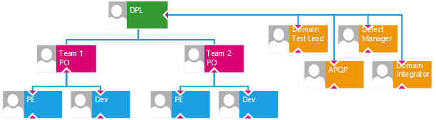
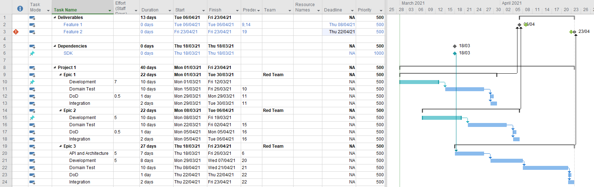
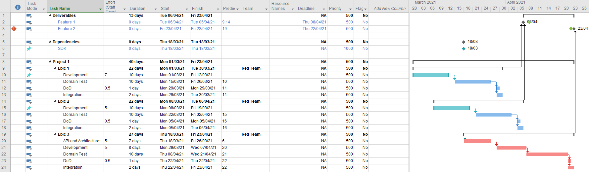

# Using Microsoft Project for Small Teams <!-- omit in toc -->

(C) Jason Curl, 2021-2022

This blog covers some best practices for using Microsoft Project for planning
small teams. Microsoft Project is a powerful tool for project planning and as
such, does require some time and mastery. It focuses on using defaults of
Microsoft Project with only a few features, which can still achieve powerful
results. Focus is on handling dependencies and approximating availability of
resources. There may be other ways to achieve the same goals of course.

The project in question already uses JIRA for managing High Level Features,
Epics and Stories. It is the due dates in Jira which are communicated outside of
the organization. The project plan can show better than Jira how to get there
(note, the project in question doesn't use Advanced Roadmaps for Jira - formally
Portfolio - for planning).

I wrote this in my spare time in March 2021 to help my team members focus on
their technical work, while still having a structured way to communicate results
to the rest of the organization (myself and other stake holders). This is
suitable for short term planning within Agile Teams.

## 1. Scope

### 1.1. What We're Trying to Achieve

A Team Lead should be able take into account:

* Deliveries and Deadlines from the Team
* Resource Planning within the Team
* Managing Dependencies and Modelling changes to them

### 1.2. Defining the Team

The team that this post is meant towards is a small team of about 5 people or
less, and we called them a *Product Owner (PO)*. The Product Owner is a
technical lead that would plan up to 5 team members. They'd be responsible for:

* following the software development processes;
* breaking down work packages for the components their team is responsible for;
* identifying the dependencies between work packages
* estimating the size of the work packages
* leading and guiding the construction to meet customer milestones.

They'd negotiate and highlight with their customers on deliveries and potential
delays.

 

Next above the Team is the Domain, lead by a Domain Project Lead, who is
responsible for managing multiple teams, or responsible for coordinating
deliveries from multiple teams into a specific project. They'd be the interface
to the customer for non-technical deliveries, but have a technical understanding
to estimate risk, describe external dependencies and ensure integration between
various teams.

## 2. Setting Up Microsoft Project and the Preconditions

### 2.1. Major Sections of the Project Plan

Create a new Microsoft Project Plan. We'll break it into three sections:

1. Deliverables. This contains deadlines that we have to meet. This might be
   high level features, initiatives, epics or interim deliveries. Anything that
   anyone outside of the team or domain might require.
2. Dependencies. This contains items and deliverables your team is dependent on
   to be able to start work.
3. Epics and major work packages. An Epic is a short duration of work, expected
   to be about a 6 week interval. If an Epic takes longer than this, it should
   probably be broken down.

### 2.2. Highlighting Colours

To make the project more readable, you'll want to create some styles for
specific features. These are the styles recommended - adjust to your own liking:

* In Microsoft Project 2016, go to the Format tab and choose Text Styles.
  * All
    * Font: Arial Narrow, 9pt
  * Milestone Tasks
    * Choose a colour, e.g. Blue
  * Summary Tasks
    * Choose a style, e.g. Bold.

### 2.3. Planning of Epics

The central work package is the Epic. The Epic is only minimally broken down
further within Microsoft Project for planning purposes. One important note about
software engineering for all Product Owners is that the creation of software is
an creative process. Typically things are done which have never been done
before, and estimation is very hard. Things go wrong, bugs are introduced. When
items are broken down in the Epic, it should generally contain instead items
which are common to all Epics, to help estimate. Each phase might be done by
different people. This is not to say that everything is new, but at least
assembling the known solutions and predicting how they'll behave is still new
and still part of the creative and learning process

* Development phase
* Testing phase before integration
* Integration phase

Breaking down the Development phase further is done separately in an estimation
session within the team. Various mechanisms can be used (mind-map, story
breakdown in Jira, etc.). You'll only want to split them within Microsoft
Project if it affects planning through dependencies and deliverables, or if it
is such a large duration that it becomes a risk (and difficult to track).
Otherwise you increase the workload within Microsoft Project with little
benefit.

### 2.4. Additional Meta-Data for the Project

Add two new Text Columns in the project (e.g. Text1 and Text2), and rename them
to the following:

* Estimated Effort (Staff-days)
  * Although this would contain numbers, and the "Number1" field might seem more
    appropriate, a text field allows to remain blank, so it is obvious if a
    field has no estimates yet.
* Team

### 2.5. Allocating Resource Names to an Epic

Generally avoid allocating resources to an Epic, unless it's known that resource
is the only person that can do the task (and would be a constraint). An agile
process suggests that instead there is a backlog and the first person available
to do that task (or the person assigned during the sprint planning) is given the
task. Putting it into Microsoft Project is an extra detail that might end up
costing more time to manage than it's worth.

## 3. Project Tasks

This section now deals with setting up the tasks and the structure. It might
look ultimately something like the example given:

### 3.1. Deliverables

Add the features that are deliverables to the customer or to other Domains.
*This section is primarily to notify you if a deliverable is going to be late,
or how much slack there is for a deliverable*.

Things to note about each Feature:

* The type is *Autoscheduled*. That means, the actual finish date shifts
  depending on the predecessors.
* It is a *milestone*, which is a duration of 0 days.
* The *Deadline* is the date to when the customer expects the feature to be
  delivered
* If the autoscheduled date exceeds the deadline, a marker will appear,
  indicating a late delivery.
  * *This helps you identify quickly any external deliveries that are going to
    be late to notify the stake holders of potential (or actual) issues.*
* Add to the predecessors the tasks of the deliverables, including integration
  if required. Typically choose the last Epic, or multiple Epics if they run in
  parallel.

### 3.2. Dependencies

These are the dependencies you need to start work. It is important to
distinguish between a blocker to start work (as here in Microsoft Project), and
MGU Jira that a blocked by prevents finishing of the work. *It's primary purpose
is to allow you to see how your project is affected when deliverables are late
(or might be delivered earlier)*. Shifting a dependency should affect your Epic
planning and quite likely deliverables.

A dependency is configured as:

* The type is *Manually Scheduled*. You want to set the date when the dependency
  will be provided. You should be able to move the date around and see how your
  model (the plan) responds.
* It is a *milestone*, which is a duration of zero days
* The *Start/Finish* date is when the dependency will be delivered to you.

### 3.3. Projects, Epics and Planning

This is where the bulk of the planning is kept. It contains the work packages
Epics, has dependencies and provides deliverables.

#### 3.3.1. Preparing an Epic

Each Epic has a phase of project development, usually in the form of:

* Architecture or Research
* Development
* Development Testing (SWE.4, SWE.5 and SWE.6 as per [Automotive
  SPICE](http://www.automotivespice.com/fileadmin/software-download/AutomotiveSPICE_PAM_31.pdf)),
  done by the developers of your team
* Domain Testing done by a separate team (this project needs two weeks minimum
  prior to review test results, implement highest priority tests required for
  integration)
* Definition of Done (ensuring that everything is done correctly)
* Integration

The example is given in the Microsoft Project diagram above. An Epic may be more
complicated, it may contain multiple steps. Sometimes it makes sense for larger
architectural topics to be split into its own Epic, but without testing and
integration (a Definition of Done is still required, to ensure the Architecture
Epic provides what's expected for the next steps, even if trivial).

#### 3.3.2. Estimating an Epic

The text column added for Effort (Staff Days) is to help the planner estimate
how much work would be required. This is similar to the estimation of story
points within the project. It should be estimated on the average case of how
much time an average developer within your team requires. This value is only
used for approximation of resource usage. One best practice observed with
project planning is to always allow slack within the project planning. Some
things to remember when planning durations for Epics:

* Estimates should be best effort, but also realistic.
  * Tasks that are unfamiliar usually have underestimated for where a breakdown
    is insufficient (missing information); and are
  * overestimated where tasks are broken down into the finest detail
    (quantization, such small tasks are difficult to estimate, so they're all
    overestimated going from 0.5 to the typical minimum unit of 1, making for a
    very large amount of phantom effort)
* Engineers usually work towards deadlines. They'll use all available time to
  fill up until the deadline ([Parkinson's
  Law](https://en.wikipedia.org/wiki/Parkinson%27s_law)).
* Possibly split Epics into what's required (what the customer immediately
  needs), and then on refactoring and improvement. (supported by [Pareto's
  Law](https://en.wikipedia.org/wiki/Pareto_principle)).
  * But don't plan the two parts so far apart, that it introduces even more
    work, quoted by [Eagleson's
    Law](https://medium.com/@jasonrigden/the-eponymous-laws-of-computer-science-8d7068658563).

As the Product Owner, you need to be able to also estimate how much time can be
given. An experience Product Owner (one who knows the team well) should be able
to estimate themselves what's required, question the team on their understanding
and fill in the gaps, coming to a more realistic estimate.

The estimate does not consider at all the duration it takes to do the work.
During development, developers experience often interrupts and other unexpected
tasks (such as bug fixing, reviews of other topics, unexpected results during
their own development).

In case an estimate is significantly wrong, the Epic needs to be reworked.

#### 3.3.3. Choose the Start Date and Duration, Define the Dependencies

Based on the estimations, and the peripheral tasks that need to be done
(testing, quality actions, integration, etc.)

Defining the first task in your Epic (which is the Development task), is
adjusted to when the task should normally start. General guidelines here are to:

* Set it to *Manually Scheduled* and set the Start/Finish date for the duration
  the task should be worked on.
* The duration should be larger than the estimated effort that is given. The
  actual duration should be given by you dependent on the number of tasks
  running in parallel

Any tasks that should continue from the first task should add their predecessors
and be then marked as *Automatically Scheduled*. Having no resources assigned to
the task assists consistent behaviour that the task is done immediately after.
This is why we created a specific field called Team.

An alternative to the first task being Manually Scheduled might be to have it
Automatically Scheduled with a Constraint Date to Not Start Before, but this
could give some strange results when scheduling. Normally Manually scheduled
tasks update the start/finish dates automatically when the predecessors change.

##### 3.3.3.1. Why to Not Allow Project to Apply Automatic Resource Levelling

Project's automatic levelling is very complicated and can lead easily to a
complete mess of the project. As the team is small, and it's relatively easy to
work on each task (the Gantt chart helps here to look for overflow), it's
probably easier to allow for manual scheduling. It depends on durations,
resource allocations, priorities and dependencies. In earlier versions, I found
that Project ignored that resources were only allocated 50%, Microsoft project
wouldn't allocate two tasks in parallel resulting in significantly underutilized
resources.

It might therefore be easier to keep the scheduling fixed, and to have Project
highlight inconsistencies than to understand how why the project plan is
suddenly different after making adjustments.

#### 3.3.4. Avoiding Dependency Spaghetti

You might notice that as your project grows, it gets harder to see dependencies
in each block. There's no reason why you can't add milestones under each Epic as
dependencies also. It would make your project plan larger, but it puts
dependencies for the Epic all in one place.

* Put the "master" dependency in the Dependencies section. It would be manually
  scheduled, and be a milestone as described above.
* In the Epic that has the dependency, you can:
  * Mark the Epic's predecessor depending on the dependency. It's not ideal as
    you'll have to continuously jump around in MSProject looking for the
    dependency
  * Mark the task that is blocked by having it's predecessor as the dependency.
    This allows more fine-grained control of planning, but still needs you to
    jump around in MSProject looking for the dependency
  * *Solution*: Create a new milestone within your Epic. It will simply "mirror"
    the dependency.
    * Add a new milestone, have it Automatic Scheduling (it can be considered a
      deliverable, you can set a deadline and everything as such too). Give it a
      descriptive name in your Epic
    * Mark that new milestone as having the predecessor for the actual
      dependency.
    * As it's Automatic, it will shift around automatically
    * Actual tasks in the Epic now depend on this pseudo milestone (which is
      tracking automatically the original dependency)
    * Everything is now in one place, and you can extend the task to be more
      descriptive describing also why you need the dependency

## 4. Analysing the Project Plan

### 4.1. Late Deliverables

The project shows a late deliverable by highlighting with a red exclamation
mark. This is clearly seen with task #3.

### 4.2. Showing the Critical Path

It is easy to highlight the critical path leading to the late deliverable (or if
it's precisely on time). Do show this, go to the Format tab, in the Bar Styles
group, and select the check box Critical Tasks. That will highlight in red the
tasks that lead to the problem. One can fix the critical task by:

* Changing the deadline. Communicate with the customer when the deadline is
  required, and seek an extension. Once that extension is obtained, then update
  the deadline accordingly
* Negotiating with other teams to shorten their tasks, as in this example the
  integration or Domain Test time. See if other tasks can be done in parallel,
  or shorten the main development task (i.e. reduce any slack).

### 4.3. Customising the Bar Style from the Team and Showing Automatically the Critical Path

Documentation for customising the Bar Styles is taken from PMConnection, and
extended here for information.

1. Add a column Flag1 to the project. This will be used to indicate if the team
   name matches or not
2. Right click on the column Flag1 and choose the menu Custom Fields
3. Choose the button Formula.. and enter the formula shown in the diagram. This
   sets the column to Yes, when the Text2 column (which contains our Team Name)
   matches 
4. Ensure all the tasks have the Team field now correctly set. You'll see the
   Flag1 column change automatically
5. From the Format tab, the Bar Styles group, choose the drop down Format option
   and select the menu item Bar Styles.
6. Add a new style at the end of the list. While the Show For ... Tasks has a
   drop down list, you'll need to have multiple conditions. Press F2 to edit the
   field and enter the fields manually 
7. You'll note that those items which are now using your style, won't show for
   the Critical Path! Thus we need to do more 
8. The final result is a Gantt that shows you what your team are working on, as
   well as what is on the critical path 

### 4.4. Looking for Resource Overbooking

The plan given in this document doesn't use resource names. The primary reason
is that the work should generally be assigned per sprint and not weeks/months in
advance. It would take the Product Owner a lot of time to continuously update
the plan as the assignee constantly changes (they might not be available due to
other projects, or that priorities change often in agile development to take up
slack). Thus, it's generally easier to consider the team as a whole and not the
individuals, and reduce the work required in maintaining the plan.

This task is done manually (but I'm sure that a Visual Basic Macro could help
here). But essentially, look at all the tasks your team is doing. For each
"region", sum up the effort and ensure that it doesn't exceed the maximum effort
which is allowable. By practice, this means scanning with eyeballs across your
tasks and doing quick sums that people aren't overbooked, or booked to 100%. As
there's usually not more than 2-3 tasks running in parallel, this is a simple
addition exercise of single digit values.
