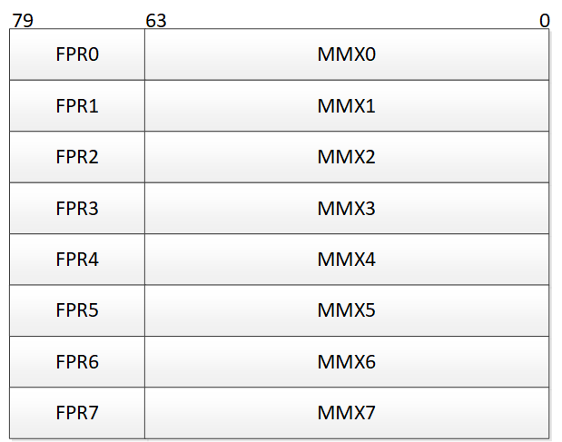
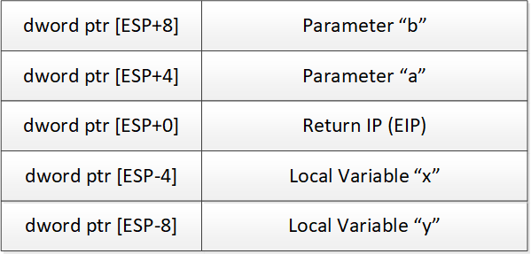
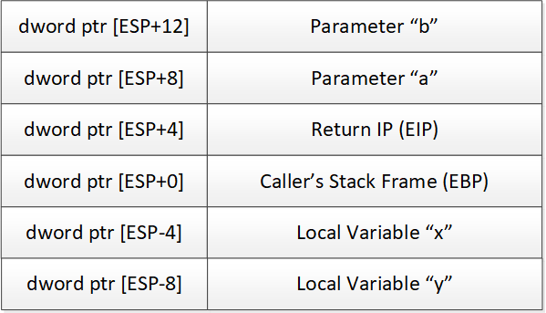

# Intel Architecture

## Intel Architecture for 32-bit

A summary of the registers and conventions are given here as a refresher.
Readers wanting more information should refer to the documentation by Intel.

### 32-bit Registers

There are 8 general purpose registers for 32-bit Intel processors:

* `EAX` - Accumulator
* `EBX` - Base register; pointer to data in the DS segment
* `ECX` - Counter register (for counter, shift and loop operations)
* `EDX` - Data register, I/O pointer
* `ESP` - Stack Pointer, in the SS segment
* `EBP` - Stack frame Base Pointer (also related to the SS segment)
* `ESI` - Source Index register for string operations. Pointer to data provided
  by the DS segment
* `EDI` - Destination Index register for string operations. Pointer to data
  provided by the ES segment.

Other important registers are:

* `EIP` - Instruction Pointer
* `FLAGS` - Condition codes

The equivalent 16-bit portions of the registers are: `AX`, `BX`, `CX`, `DX`,
`SP`, `BP`, `SI`, `DI`, and `IP`. The 8-bit registers are (`H` high byte; `L`
low byte): `AL`, `AH`, `BL`, `BH`, `CL`, `CH`, `DL`, `DH`, `SIL` and `DIL`.
There is no 8-bit equivalent for `SP`, `BP` and `IP`.

The list of segment registers are:

* `CS` - Code Segment
* `DS` - Data Segment
* `SS` - Stack Segment
* `ES` - Extra Segment (Data segment)
* `FS` - F Segment (Data segment), from 80386 and later
* `GS` - G Segment (Data segment), from 80386 and later

The 80-bit FPU registers are overlaid with the 64-bit MMX registers

 

There are also 8 general purpose SSE registers: `XMM0`, `XMM1`, `XMM2`, `XMM3`,
`XMM4`, `XMM5`, `XMM6` and `XMM7`.

### Stack Frames

There are two implementations of a stack frame seen when disassembling code. One
based on the stack pointer (`ESP`), the other implementation based on the stack
frame base pointer (`EBP`). The offsets in the following figures are relative to
the code in the callee.

#### ESP Based Stack Frames

The stack frame described below indicates generally the offsets referenced from
the `ESP` stack pointer. Many compilers (e.g. GCC with the option
`-fomit-frame-pointers`) generate such stack frames as part of their
optimisation to reduce code size. Some debuggers however are not able to show
stack information for code compiled.

 

#### EBP Based Stack Frames

The normal practice for unoptimized code generation is to use the `EBP` register
as the stack frame pointer. The callee is generally responsible for preserving
the `EBP` register so it is unchanged on exit. The equivalent stack frame based
on `EBP` is provided below:

 

The callee usually has the following prologue:

```asm
  10001000: 55                 push        ebp
  10001001: 8B EC              mov         ebp,esp
```

And the epilogue is one of the following:

```asm
  10001010: 5D                 pop         ebp
  10001011:                    mov         esp,ebp
  10001013: C2 08 00           ret         8
```

or

```asm
  10001010: C9                 leave
  10001011: C2 08 00           ret         8
```

## Intel Architecture for 64-bit

### 64-bit Registers

There are considerably more general purpose registers available on 64-bit AMD
processors. The general purpose registers are:

* `RAX`, `RBX`, `RCX`, `RDX` which are 64-bit extensions of the 32-bit `EAX`,
  `EBX`, `ECX`, `EDX`
* `RBP`, `RDI`, `RSI` which are 64-bit extensions of the 32-bit `EBP`, `EDI`,
  `ESI`
* `R8`, `R9`, `R10`, `R11`, `R12`, `R13`, `R14`, `R15` are new. 32-bit, 16-bit
  and 8-bit variants are accessed via `RnD`, `RnW`, `RnB` respectively.
* `RSP` which are 64-bit extensions to the 32-bit `ESP`

Other important registers are:

* `RIP` - 64-bit Instruction Pointer
* `FLAGS` - Condition codes

The list of segment registers remain. They are mostly unused in the 64-bit
model. The segment registers `FS` and `GS` can have the upper 32-bits set
through `MSRs`.

* `CS` - Code Segment (ignored)
* `DS` - Data Segment (ignored)
* `SS` - Stack Segment (ignored)
* `ES` - Extra Segment (ignored)
* `FS` - F Segment (Data segment)
* `GS` - G Segment (Data segment)

To quote
[AMD](http://stackoverflow.com/questions/8284756/ia-32e-64-bit-idt-gate-descriptor):

> Segmentation is disabled in 64-bit mode, and code segments span all of virtual
> memory. In this mode, code-segment base addresses are ignored. For the purpose
> of virtual-address calculations, the base address is treated as if it has a
> value of zero. Data segments referenced by the `FS` and `GS` segment registers
> receive special treatment in 64-bit mode. For these segments, the base address
> field is not ignored, and a non-zero value can be used in virtual-address
> calculations. A 64-bit segment-base address can be specified using model
> specific registers. Unlike the `CS`, `DS`, `ES`, and `SS` segments, the `FS`
> and `GS` segment overrides can be used in 64-bit mode. When `FS` and `GS`
> segment overrides are used in 64-bit mode, their respective base addresses are
> used in the effective-address (EA) calculation. The complete EA calculation
> then becomes (`FS` or `GS`)`.base + base + (scale + index) + displacement`.
> The `FS.base` and `GS.base` values are also expanded to the full 64-bit
> virtual-address size. The resulting EA calculation is allowed to wrap across
> positive and negative addresses.

[Wikipedia](http://en.wikipedia.org/wiki/X86_memory_segmentation) has
information about the usage of the `GS` segment register

> Microsoft Windows 64-bit uses the `GS` segment to point to the Thread
> Environment Block, a small data structure for each thread, which contains
> information about exception handling, thread- local variables, and other
> per-thread state. Similarly, the Linux kernel uses the `GS` segment to store
> per-CPU data.

The MMX registers continue to exist as is for 32-bit. There are in addition 8
new XMM registers: `XMM8`, `XMM9`, `XMM10`, `XMM11`, `XMM12`, `XMM13`, `XMM14`
and `XMM15`.

## Flags

The flags register contains the results of various operations. To summarise, the
following flags are defined

| Bit    | Flag    | Description                                                                                                                                                                                                                                                                                                                                                                                                                                                                        |
| ------ | ------- | ---------------------------------------------------------------------------------------------------------------------------------------------------------------------------------------------------------------------------------------------------------------------------------------------------------------------------------------------------------------------------------------------------------------------------------------------------------------------------------- |
| 0      | CF(S)   | Carry Flag: Set if the last arithmetic operation carried (addition) or borrowed (subtraction) a bit beyond the size of the register. This is then checked when the operation is followed with an add-with-carry or subtract-with-borrow to deal with values too large for just one register to contain.                                                                                                                                                                            |
| 2      | PF(S)   | Parity Flag. Set if the number of bits in the least significant byte of the result is a multiple of 2.                                                                                                                                                                                                                                                                                                                                                                             |
| 4      | AF(S)   | Adjust Flag. Carry of Binary Code Decimal (BCD) numbers arithmetic operations. This is the carry or borrow of bit 3 of the result for BCD arithmetic.                                                                                                                                                                                                                                                                                                                              |
| 6      | ZF(S)   | Zero Flag. Set if the result of an operation is Zero (0).                                                                                                                                                                                                                                                                                                                                                                                                                          |
| 7      | SF(S)   | Sign Flag. Set if the result of an operation is negative.                                                                                                                                                                                                                                                                                                                                                                                                                          |
| 8      | TF(X)   | Trap Flag. Set if step by step debugging.                                                                                                                                                                                                                                                                                                                                                                                                                                          |
| 9      | IF(X)   | Interruption Flag. Set if interrupts are enabled.                                                                                                                                                                                                                                                                                                                                                                                                                                  |
| 10     | DF(C)   | Direction Flag. Stream direction. If set, string operations will decrement their pointer rather than incrementing it, reading memory backwards.Setting the DF flag causes the string instructions to auto-decrement (to process strings from high addresses to low addresses). Clearing the DF flag causes the string instructions to auto-increment (process strings from low addresses to high addresses). The STD and CLD instructions set and clear the DF flag, respectively. |
| 11     | OF(S)   | Overflow Flag. Set if signed arithmetic operations result in a value too large for the register to contain.                                                                                                                                                                                                                                                                                                                                                                        |
| 12, 13 | IOPL(X) | I/O Privilege Level field (2 bits). I/O Privilege Level of the current process.                                                                                                                                                                                                                                                                                                                                                                                                    |
| 14     | NT(X)   | Nested Task flag. Controls chaining of interrupts. Set if the current process is linked to the next process.                                                                                                                                                                                                                                                                                                                                                                       |
| 16     | RF(X)   | Resume Flag. Response to debug exceptions                                                                                                                                                                                                                                                                                                                                                                                                                                          |
| 17     | VM(X)   | Virtual-8086 Mode. Set if in 8086 compatibility mode.                                                                                                                                                                                                                                                                                                                                                                                                                              |
| 18     | AC(X)   | Alignment Check. Set if alignment checking of memory references is done.                                                                                                                                                                                                                                                                                                                                                                                                           |
| 19     | VIF(X)  | Virtual Interrupt Flag. Virtual image of IF.                                                                                                                                                                                                                                                                                                                                                                                                                                       |
| 20     | VIP(X)  | Virtual Interrupt Pending flag. Set if an interrupt is pending.                                                                                                                                                                                                                                                                                                                                                                                                                    |
| 21     | ID(X)   | Identification Flag. Support for CPUID instruction if can be set.                                                                                                                                                                                                                                                                                                                                                                                                                  |

where:

* S is a Status Flag
* C is a Control Flag
* X is a System Flag

### Condition Names

Condition names are those used in instructions for testing and jumping. The
conditions are based on the `FLAGS` register described in the table above.

| Condition | Flags | Meaning                                                                                                           |
| --------- | ----- | ----------------------------------------------------------------------------------------------------------------- |
| Z         | ZF=1  | Result of last operation was zero                                                                                 |
| NZ        | ZF=0  | Result of last operation was not zero                                                                             |
| C         | CF=1  | Last operation required a carry or borrow. For unsigned integers, this indicates an overflow                      |
| NC        | CF=0  | Last operation did not require a carry or borrow. For unsigned integers, this indicates that no overflow occurred |
| S         | SF=1  | Result of last operation has its high bit set.                                                                    |
| NS        | SF=0  | Result of last operation has its high bit clear.                                                                  |
| O         | OF=1  | When treated as a signed integer operation, the last operation caused an overflow or underflow.                   |
| NO        | OF=0  | When treated as signed integer operation, the last operation did not cause an overflow or underflow.              |

The following conditions are to be interpreted after a `CMP` operation.

| Condition | Flags          | Meaning                                         |
| --------- | -------------- | ----------------------------------------------- |
| E         | ZF=1           | Equal. value1 == value2.                        |
| NE        | ZF=0           | Not Equal. value1 != value2.                    |
| GE / NL   | SF=OF          | Greater or Equal / Not Lower. value1 >= value2. |
| LE / NG   | ZF=1 or SF!=OF | Less or Equal / Not Greater. value1 <= value2.  |
| G / NLE   | ZF=0 and SF=OF | Greater / Not Lower or Equal. value1 > value2.  |
| L / NGE   | SF!=OF         | Lower / Not Greater or Equal. value1 < value2.  |
| AE / NB   | CF=0           | Above or Equal, Not Below. value1 >= value2.    |
| BE / NA   | CF=1 or ZF=1   | Below or Equal / Not Above. value1 <= value2.   |
| A / NBE   | CF=0 and ZF=0  | Above / Not Below or Equal. value1 > value2.    |
| B / NAE   | CF=1           | Below / Not Above or Equal. value1 < value2     |

## Word Sizes

The following word sizes are used in this document, especially when describing
stack frames.

| Mnemonic | Size                  |
| -------- | --------------------- |
| `word`   | 2 bytes               |
| `dword`  | 4 bytes (double word) |
| `qword`  | 8 bytes (quad word)   |
| `oword`  | 16 bytes (octal word) |
| `yword`  | 32 bytes (y word)     |
| `zword`  | 64 bytes (z word)     |
